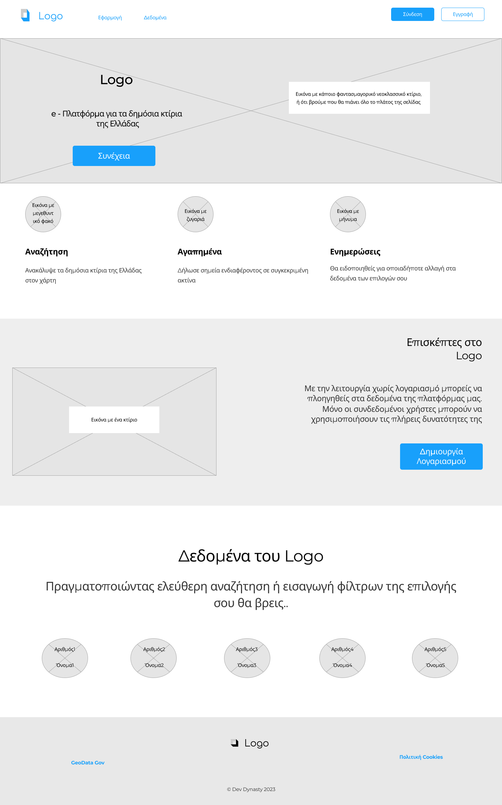
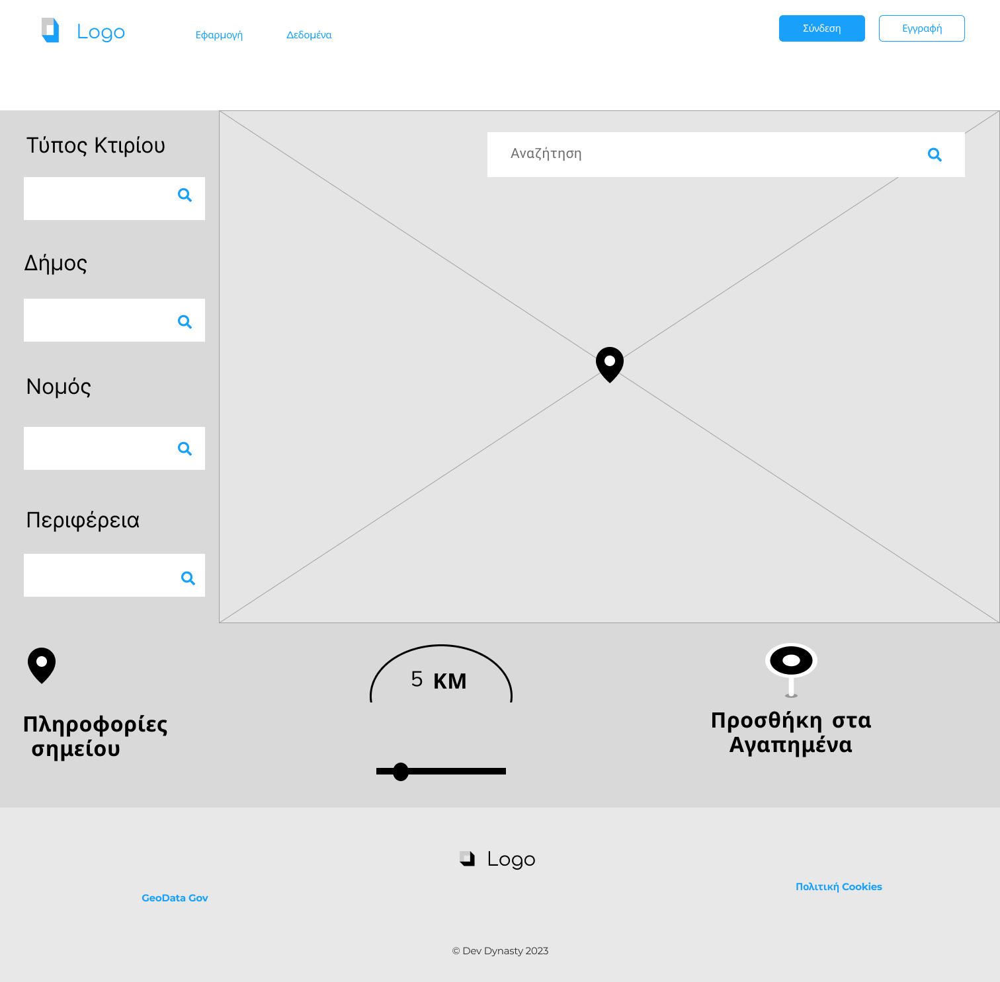

# UI Prototypes

Η πρώτη έκδοση της εφαρμογής σε μορφή πρωτοτύπων μέσης και χαμηλής πιστότητας.  
Η αρχική σελίδα ενημερώνει τον χρήστη για το περιεχόμενο της εφαρμογής.
Η κύρια δυνατότητα είναι η αναζήτηση στα δεδομένα του
[Geodata](https://geodata.gov.gr/). Για αυτό το λόγο προσφέρουμε την αναζήτηση σε 
ξεχωριστή σελίδα και μόνο από εκεί. Τα προφίλ προσφέρουν τις δυνατότητες που
αναφέρονται στην εκφώνηση. Η εφαρμογή που έχουμε να υλοποιήσουμε, επειδή τελικά προσφέρει μία αναζήτηση σε χάρτη, 
θα προσπαθήσουμε να κάνουμε αυτή την αναζήτηση όσο πιο αποτελεσματική γίνεται για τον χρήστη.
Κάποιοι σύνδεσμοι σε navigation και footer δε θα υλοποιηθούν, όμως είναι χρήσιμοι για να γεμίσει το περιεχόμενο.

## Αρχική Σελίδα

## Σελίδα Αναζήτησης

# Προφίλ

# Προφίλ Admin

# Εγγραφή

# Σύνδεση

